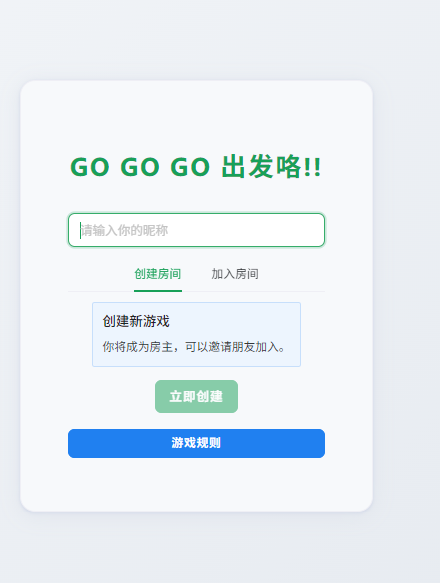
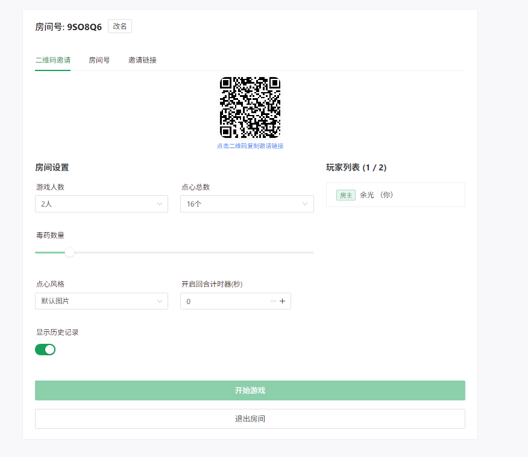
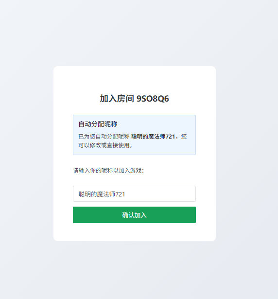
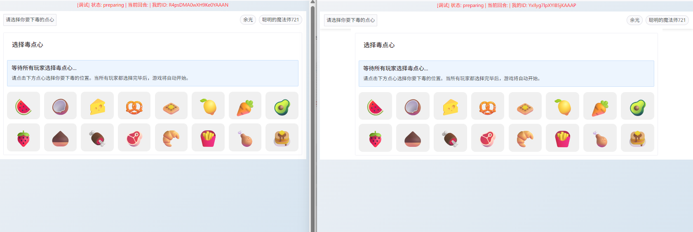
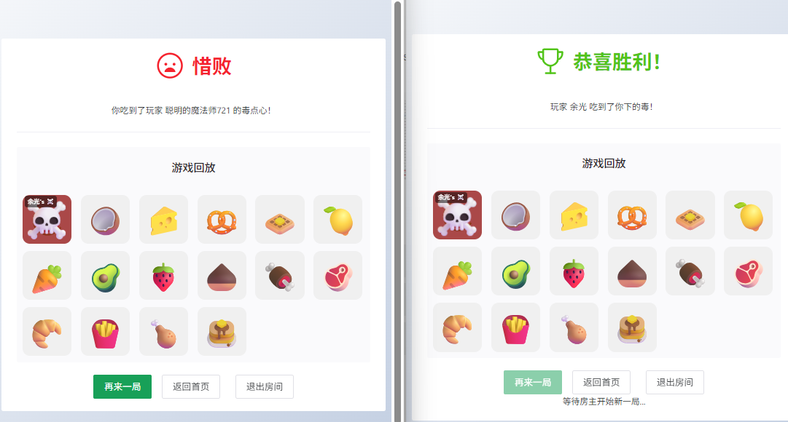

# GO GO GO 出发咯!! 🎮（女巫的毒药网页版适配手机端）

一个基于 Vue.js 和 Socket.io 的多人在线策略游戏！


## 🎯 游戏简介

GO GO GO 出发咯!! 游戏开始时，每位玩家秘密选择一个"毒点心"，然后玩家轮流选择并"吃掉"点心。如果玩家吃到了其他人的毒点心，就会立即出局。最后存活的玩家获得胜利！

## 📱 游戏截图

### 🏠 主页界面
<div align="center">
  
</div>


### 🎛️ 房间准备
<div align="center">
  
</div>


### 🎮 邀请链接打开状态
<div align="center">
  
</div>


### 🏆毒药选择界面
<div align="center">
  
</div>


### 🏆游戏结算
<div align="center">
  
</div>


## ✨ 功能特色

### 🎮 游戏功能
- **多人实时对战** - 支持2-6人同时游戏
- **策略性玩法** - 毒点心机制带来心理博弈
- **轮流制** - 公平的回合制游戏体验
- **胜负判定** - 自动判定游戏结束和获胜者

### 🎨 界面特色  
- **多样化点心样式** - 支持默认图标、表情符号主题、自定义图片
- **响应式设计** - 完美适配手机和桌面设备
- **美观UI** - 基于 Naive UI 的现代化界面
- **实时状态** - 即时显示游戏状态和玩家操作

### ⚙️ 游戏设置
- **可调节点心数量** - 6/8/10/12/14/16个点心可选
- **灵活玩家数量** - 2-6人房间支持
- **回合计时器** - 可选择是否启用30秒倒计时
- **历史记录** - 可查看游戏操作历史
- **音效支持** - 丰富的游戏音效体验

### 🔗 房间系统
- **创建房间** - 房主可自定义游戏设置
- **加入房间** - 通过6位房间号快速加入
- **实时同步** - 所有玩家状态实时同步
- **断线重连** - 支持网络中断后重新连接

## 🛠️ 技术栈

### 前端技术
- **Vue.js 3** - 渐进式JavaScript框架
- **Vue Router 4** - 官方路由管理器
- **Pinia 3** - 现代化状态管理
- **Naive UI** - 优雅的Vue 3组件库
- **Socket.io Client** - 实时双向通信
- **Vite** - 快速的构建工具

### 后端技术
- **Node.js** - JavaScript运行时环境
- **Express.js** - Web应用框架
- **Socket.io** - 实时通信引擎
- **Multer** - 文件上传中间件
- **CORS** - 跨域资源共享

### 开发工具
- **Vite** - 现代化前端构建工具
- **ESM** - ES模块化支持
- **Hot Reload** - 热重载开发体验

## 📦 安装部署

### 环境要求
- Node.js >= 16.0.0
- npm >= 8.0.0

### 快速开始

1. **克隆项目**
```bash
git clone https://github.com/your-username/game.git
cd game
```

2. **安装前端依赖**
```bash
npm install
```

3. **安装后端依赖**
```bash
cd server
npm install
cd ..
```

4. **启动后端服务器**
```bash
cd server
npm start
```
后端服务将在 `http://localhost:3000` 启动

5. **启动前端开发服务器**
```bash
npm run dev
```
前端服务将在 `http://localhost:5173` 启动

### 生产环境部署

1. **构建前端项目**
```bash
npm run build
```

2. **部署静态文件**
将 `dist` 目录下的文件部署到Web服务器

3. **配置后端环境**
修改 `server/server.js` 中的CORS设置和端口配置

## 🎮 游戏规则

### 基本玩法
1. **准备阶段** - 每位玩家秘密选择一个毒点心位置
2. **游戏开始** - 所有玩家选择完毕后，随机决定首位玩家
3. **轮流行动** - 玩家按顺序选择并"吃掉"一个点心
4. **淘汰机制** - 吃到他人毒点心的玩家立即出局
5. **胜利条件** - 最后存活的玩家获得胜利

### 策略要点
- **心理博弈** - 观察其他玩家的选择模式
- **风险评估** - 权衡安全选择与冒险行为
- **信息收集** - 利用历史记录分析对手策略
- **时机把握** - 在倒计时模式下快速决策

## 📁 项目结构

```
game/
├── public/                 # 静态资源
├── src/                    # 前端源码
│   ├── components/         # Vue组件
│   │   ├── RoomPanel.vue   # 房间面板
│   │   ├── SnackItem.vue   # 点心组件
│   │   └── ...
│   ├── views/              # 页面组件
│   │   ├── Home.vue        # 主页
│   │   ├── Battle.vue      # 游戏页面
│   │   ├── Preparation.vue # 准备页面
│   │   └── Settlement.vue  # 结算页面
│   ├── store/              # 状态管理
│   │   └── game.js         # 游戏状态
│   ├── socket/             # Socket.io配置
│   ├── router/             # 路由配置
│   └── composables/        # 组合式函数
├── server/                 # 后端代码
│   ├── server.js           # 主服务器文件（这个得看里面有配置服务地址）
│   ├── uploads/            # 文件上传目录
│   └── package.json        # 后端依赖
└── package.json            # 前端依赖
```

## 🔧 配置说明

### 游戏设置
- `maxPlayers`: 最大玩家数量 (2-6)
- `snackCount`: 点心数量 (6/8/10/12/14/16)
- `turnTimer`: 回合计时器 (0=关闭, 30秒)
- `showHistory`: 是否显示历史记录
- `snackStyle`: 点心样式 (default/food/animals/transport/objects/custom)

### 环境变量
创建 `.env` 文件配置环境变量：
```env
VITE_SERVER_URL=http://localhost:3000（配不配都行用俩服务还没写成统一的环境变量）
```

## 🚀 开发指南

### 本地开发
1. 确保前后端服务都在运行
2. 修改代码后会自动热重载
3. 使用浏览器开发者工具调试

### 添加新功能
1. 前端组件开发在 `src/components/` 或 `src/views/`
2. 后端逻辑开发在 `server/server.js`
3. Socket事件定义在 `src/socket/index.js`

### 测试
使用多个浏览器窗口模拟多人游戏进行测试

---

⭐ 如果这个项目对您有帮助，请给它一个星标！
